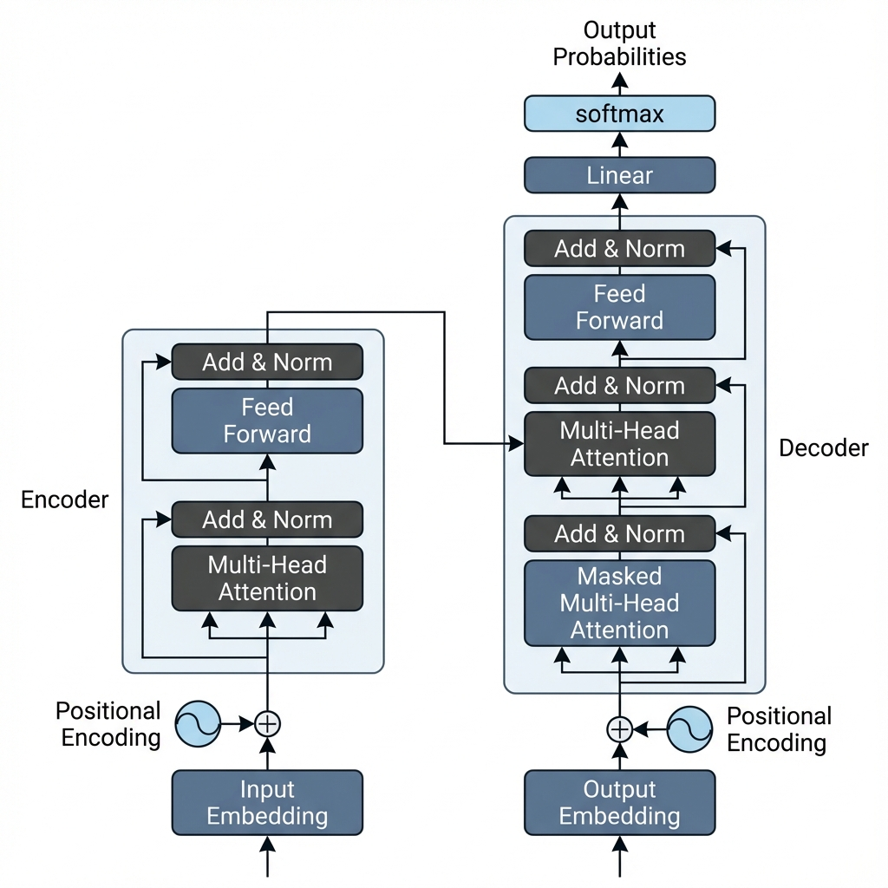

# Section 1: Prerequisites & The Roadmap

This is a comprehensive deep dive on transformers. We will be implementing and building every component of transformers ourselves from scratch, with a high focus on the math to better and deeply understand *why* and *how* the transformer works.

## 1. The Landscape of Large Language Models

The lifecycle of an LLM typically involves four key stages, moving from massive data processing to efficient deployment (Xu et al., 2024):

1.  **Pre-training**: The model learns fundamental patterns ("world knowledge") by predicting the next token on essentially internet-scale data. This phase relies heavily on the **Transformer Architecture**.
2.  **Fine-tuning**: The model is adapted to specific tasks (Instruction Tuning) or aligned with user intent (RLHF).
3.  **Inference**: The phase where the trained model generates predictions. Efficiency techniques like KV-Caching are standard here.
4.  **Utilization**: The application of the model via prompting and agentic workflows.

> [!IMPORTANT]
> **Data Quality**: The quality of the pre-training corpus is the primary determinant of model capability. No architectural improvements can fully compensate for poor data.

*Figure 1: High-level overview of the Transformer architecture, showing the interaction between the Encoder and Decoder through Multi-Head Attention.*

## 2. Mathematical Foundations

A deep understanding of Transformers requires intuition in Linear Algebra and Probability.

### Linear Algebra
*   **Vectors**: High-dimensional representations of data. In NLP, words and tokens are mapped to dense vectors (embeddings).
    *   *Intuition*: Semantic similarity is encoded as geometric proximity.
*   **Dot Product**: A scalar measure of similarity between two vectors $A$ and $B$.
    $$ A \cdot B = ||A|| ||B|| \cos(\theta) $$
    *   This operation is the core of the **Attention Mechanism**.
*   **Matrices**: Linear transformations that map vectors from one space to another. A weight matrix $W$ transforms an input $x$ into a new representation $y = Wx$.

### Probability
*   **Softmax Function**: Converts a vector of raw scores (logits) into a probability distribution.
    $$ \text{Softmax}(x_i) = \frac{e^{x_i}}{\sum_j e^{x_j}} $$
    *   Large positive logits result in probabilities near 1, while negative logits result in probabilities near 0.
*   **Entropy**: A measure of uncertainty in a probability distribution. High entropy implies high uncertainty (uniform distribution), while low entropy implies confidence.

## 3. Environment Setup

We utilize **PyTorch** as our primary framework due to its flexibility and dominance in research.

### Core Libraries
*   `torch`: The core deep learning library for tensor computation and automatic differentiation.
*   `numpy`: Used for basic numerical operations and data manipluation.
*   `matplotlib`: Essential for visualizing vector interactions and attention weights.

The accompanying notebook focuses on implementing `einsum`, `bmm`, and shape manipulations from scratch to build the necessary tensor intuition.

## References

*   **[Attention Is All You Need (Vaswani et al., 2017)](https://arxiv.org/abs/1706.03762)**
    *   The foundational paper proposing the Transformer architecture.
*   **[Understanding LLMs: A Comprehensive Overview from Training to Inference (Xu et al., 2024)](https://arxiv.org/abs/2401.02038)**
    *   A comprehensive survey of the current LLM lifecycle and ecosystem.
*   **[The Illustrated Transformer (Jay Alammar)](https://jalammar.github.io/illustrated-transformer/)**
    *   A visual guide to the inner workings of the Transformer.
