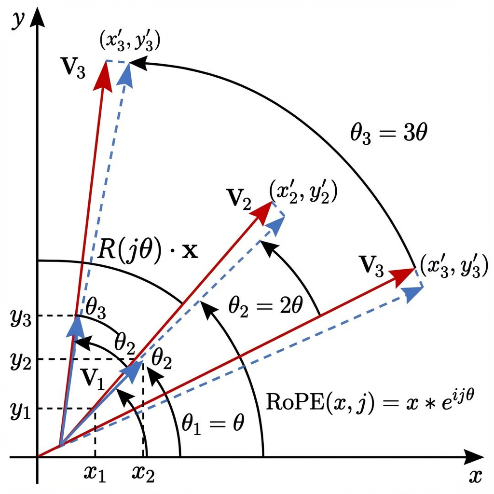

# Section 2: Input Processing

We are now entering the machine. The first challenge is translating human language—messy, variable-length text—into fixed-size numerical vectors that a neural network can process.

## 1. Tokenization

Computers cannot "read." They only process numbers. We must break text into smaller units called **tokens**.

### The Problem
*   **Character-Level**: Too granular. The sequence "The" becomes `['T', 'h', 'e']`. This makes sequences incredibly long and destroys semantic meaning (is "h" related to "house"?).
*   **Word-Level**: Too sparse. English has hundreds of thousands of words. If we encounter a new word like "Transformers", it becomes `<UNK>` (Unknown), losing all information.

### The Solution: Subword Tokenization

#### BPE (Byte Pair Encoding)
**Byte Pair Encoding (BPE)** (Gage, 1994) which is used in GPT finds the sweet spot. It starts with characters and iteratively merges the most frequent adjacent pairs.

*   *Example*: "high", "highest", "higher".
    *   Instead of storing three separate words, we might store "high" and suffixes "est", "er".
    *   An unseen word like "highland" can be tokenized as `["high", "land"]`.

**Algorithm:**
1.  **Initialize** vocabulary with all unique characters.
2.  **Count** frequency of all adjacent pairs in the corpus.
3.  **Merge** the most frequent pair (e.g., 'e' and 's' -> 'es').
4.  **Repeat** until vocabulary size reaches the target limit.

#### WordPiece
Used in the BERT fanily, WordPiece (Schuster & Nakajima, 2012) is similar to BPE but with a key mathematical difference in how merges are chosen.

While BPE merges the *most frequent* pair, WordPiece merges the pair that maximizes the **likelihood** of the training data. This is equivalent to maximizing the score:

$$ \text{Score}(A, B) = \frac{\text{freq}(AB)}{\text{freq}(A) \times \text{freq}(B)} $$

*   **Intuition**: We want to merge pairs that appear together much more often than they would by pure chance (independent distributions).
*   **Effect**: This penalizes pairs like "Th" which are common simply because "T" and "h" are both very common characters. It favors pairs like "Z" + "u" in "Azure" where the individual parts are rare, but their conjunction strongly signals a specific unit.

## 2. Embeddings

Once we have integers (tokens), we map them to dense vectors.

$$ E(x) \rightarrow \mathbb{R}^{d_{model}} $$

This is a simple lookup table. If our vocabulary size is $V$ and our model dimension is $d_{model}$, our embedding matrix $W_E$ is size $(V, d_{model})$.
Why learn this? Because we want the vector for "King" minus "Man" plus "Woman" to equal "Queen". We want semantics.

## 3. Positional Encoding

Transformers process all tokens in parallel. The model has no idea that token $x_1$ comes before $x_2$. We must inject this information.

### The Sinusoidal Formulation
Vaswani et al. (2017) used fixed sine and cosine functions of different frequencies:

$$ PE_{(pos, 2i)} = \sin\left(\frac{pos}{10000^{2i/d_{model}}}\right) $$
$$ PE_{(pos, 2i+1)} = \cos\left(\frac{pos}{10000^{2i/d_{model}}}\right) $$

*   **Why?** It allows the model to potentially learn to attend by relative positions, since for any fixed offset $k$, $PE_{pos+k}$ can be represented as a linear function of $PE_{pos}$.
*   **Wavelengths**: Low dimensions (small $i$) have high frequency (rapid changes). High dimensions (large $i$) have low frequency (slow changes). This creates a unique "fingerprint" for every position.

## 4. Advanced Topics

Modern Transformers have evolved beyond the original 2017 paper.

*Figure 2: Representation of Rotary Positional Embeddings. Each token vector is rotated by an angle determined by its position, naturally encoding relative distance.*

### Rotary Positional Embeddings (RoPE)
Used in **Llama 2, Mistral, and PaLM**.
Instead of adding a vector to the embedding ($x + p$), RoPE **rotates** the vector in the complex plane.
*   **Concept**: Token position determines the angle of rotation.
*   **Result**: The dot product $q \cdot k$ naturally encodes relative distance because rotation preserves magnitude but encodes the angle difference $(m - n)$.
*   **Math**:
    $$ R_{\theta, m} x = \begin{pmatrix} \cos m\theta & -\sin m\theta \\ \sin m\theta & \cos m\theta \end{pmatrix} \begin{pmatrix} x_1 \\ x_2 \end{pmatrix} $$

### Context Extrapolation (ALiBi & YaRN)
*   **ALiBi (Attention with Linear Biases)**: Instead of positional embeddings, simply subtract a penalty from attention scores based on distance. Far away tokens get lower scores.
*   **YaRN (Yet another RoPE extensioN)**: A method to extend the context window (e.g., 4k -> 128k) by interpolating the rotation frequencies.

## References

*   **[A New Algorithm for Data Compression (Gage, 1994)](http://www.pennelynn.com/Documents/CUJ/HTML/94HTML/19940045.HTM)**
    *   The original paper introducing Byte Pair Encoding.
*   **[Japanese and Korean Voice Search (Schuster & Nakajima, 2012)](https://research.google/pubs/japanese-and-korean-voice-search/)**
    *   The paper introducing WordPiece.
*   **[BERT: Pre-training of Deep Bidirectional Transformers for Language Understanding (Devlin et al., 2018)](https://arxiv.org/abs/1810.04805)**
    *   Famous model utilizing WordPiece tokenization.
*   **[RoFormer: Enhanced Transformer with Rotary Position Embedding (Su et al., 2021)](https://arxiv.org/abs/2104.09864)**
    *   The paper introducing RoPE.
*   **[Train Short, Test Long: Attention with Linear Biases (Press et al., 2021)](https://arxiv.org/abs/2108.12409)**
    *   The ALiBi paper for length extrapolation.
*   **[YaRN: Efficient Context Window Extension (Peng et al., 2023)](https://arxiv.org/abs/2309.00071)**
    *   Modern technique for extending Llama context windows.
