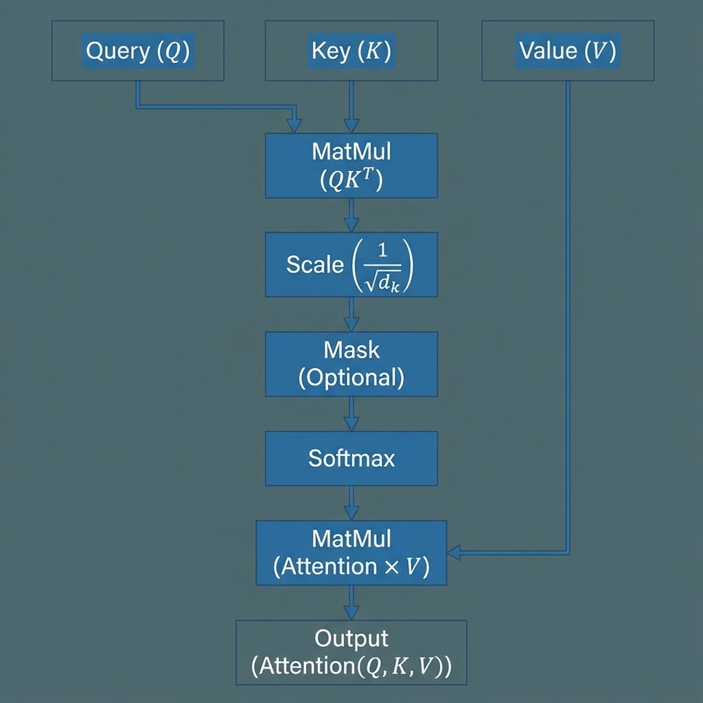

# Section 3: The Attention Mechanism

We have processed our tokens and injected positional information. Now, we implement the core of the Transformer: **Attention**. This mechanism allows the model to dynamically focus on different parts of the input sequence, effectively modeling long-range dependencies.

## 1. Scaled Dot-Product Attention

The fundamental operation of the Transformer is **Scaled Dot-Product Attention**. It can be viewed as a "soft" version of a dictionary lookup, where a query is matched against a set of keys to retrieve weighted values.


*Figure 3: Detailed flow of the Scaled Dot-Product Attention mechanism, including the scaling factor and softmax normalization.*

### 1.1 Mathematical Formulation

Given Query ($Q$), Key ($K$), and Value ($V$) matrices, the attention output is calculated as:

$$ \text{Attention}(Q, K, V) = \text{softmax}\left(\frac{QK^T}{\sqrt{d_k}}\right)V $$

Where:
*   **$Q \in \mathbb{R}^{T \times d_k}$**: The Query matrix (what we are looking for).
*   **$K \in \mathbb{R}^{T \times d_k}$**: The Key matrix (what we match against).
*   **$V \in \mathbb{R}^{T \times d_v}$**: The Value matrix (the information to be retrieved).
*   **$d_k$**: The dimensionality of the keys.
*   **$\frac{1}{\sqrt{d_k}}$**: The scaling factor.

### 1.2 Intuition: The Scoring Mechanism

1.  **Similarity ($QK^T$)**: The dot product between a query and a key measures their alignment. A higher dot product signifies that the query "attends" more strongly to that key's corresponding value.
2.  **Scaling**: As $d_k$ increases, the magnitude of the dot products grows, pushing the softmax function into regions with extremely small gradients. Dividing by $\sqrt{d_k}$ stabilizes training.
3.  **Softmax**: Normalizes the scores into a probability distribution (summing to 1).
4.  **Aggregation**: The final output is a weighted sum of the values, where the weights are defined by the attention scores.

---

## 2. Multi-Head Attention (MHA)

Instead of performing a single attention function, we can project $Q, K$, and $V$ into multiple subspaces and perform attention in parallel. This allows the model to capture different types of relationships simultaneously (e.g., syntactic vs. semantic).

### 2.1 Mathematical Formulation

$$ \text{MultiHead}(Q, K, V) = \text{Concat}(\text{head}_1, \dots, \text{head}_h)W^O $$

Where each head is defined as:
$$ \text{head}_i = \text{Attention}(QW_i^Q, KW_i^K, VW_i^V) $$

And the projections are learnable parameter matrices:
*   $W_i^Q \in \mathbb{R}^{d_{model} \times d_k}$
*   $W_i^K \in \mathbb{R}^{d_{model} \times d_k}$
*   $W_i^V \in \mathbb{R}^{d_{model} \times d_v}$
*   $W^O \in \mathbb{R}^{hd_v \times d_{model}}$

> [!NOTE]
> In practice, we usually set $d_k = d_{v} = d_{model} / h$. This ensures that the total computational cost is similar to single-head attention with full dimensionality.

---

## 3. Advanced Topics: Efficiency & Optimization

As sequence lengths grow, the $O(T^2)$ complexity of standard attention becomes a bottleneck. Modern architectures employ several optimizations.

### 3.1 Flash Attention: IO-Awareness

Flash Attention (Dao et al., 2022) is an exact attention algorithm that optimizes for GPU memory hierarchy.
*   **Problem**: Standard attention writes the $T \times T$ attention matrix to High-Bandwidth Memory (HMB), causing a memory bottleneck.
*   **Solution**: By using **tiling**, Flash Attention breaks the matrices into blocks that fit in on-chip SRAM. It computes the attention output incrementally without ever materializing the full $O(T^2)$ matrix in HMB.

### 3.2 Grouped Query Attention (GQA)

Used in models like **Llama 2 (70B) and Llama 3**, GQA is a compromise between Multi-Head Attention (MHA) and Multi-Query Attention (MQA).
*   **MHA**: Every Query head has its own Key/Value head.
*   **MQA**: All Query heads share a SINGLE Key/Value head (efficient but lower capacity).
*   **GQA**: Query heads are divided into groups, and each group shares one Key/Value head.

### 3.3 Sliding Window Attention (SWA)

Introduced by Mistral, SWA limits the attention range for each token to a fixed window $W$. This reduces complexity to $O(T \times W)$, making long-context inference feasible.

---

## 4. Visualizing Masked Attention

Applying the causal/look-ahead mask to the attention scores ensures that each token can only attend to previous tokens and itself. This is critical for autoregressive generation in Decoders.

```python
# Applying the Causal Mask
mask = create_look_ahead_mask(len(tokens))
output_masked, weights_masked = scaled_dot_product_attention(qkv, qkv, qkv, mask=mask)

# Original vs Masked Attention
fig, axes = plt.subplots(1, 2, figsize=(16, 7))
axes[0].imshow(weights_matrix, cmap='viridis')
axes[0].set_title("Unmasked Attention")
# ... (see notebook for full visualization code)
axes[1].imshow(weights_masked[0, 0].cpu().numpy(), cmap='viridis')
axes[1].set_title("Masked Attention (Causal)")
plt.show()
```

---

## References

*   **[Attention Is All You Need (Vaswani et al., 2017)](https://arxiv.org/abs/1706.03762)**
    *   The foundational paper introducing the Transformer and MHA.
*   **[FlashAttention: Fast and Memory-Efficient Exact Attention with IO-Awareness (Dao et al., 2022)](https://arxiv.org/abs/2205.14135)**
    *   Reformulating attention to optimize for GPU memory hierarchy.
*   **[GQA: Training Generalized Multi-Query Transformer Models (Ainslie et al., 2023)](https://arxiv.org/abs/2305.13245)**
    *   The paper introducing Grouped Query Attention for efficient LLM inference.
*   **[Understanding LLMs: A Comprehensive Overview (Xu et al., 2024)](https://arxiv.org/abs/2401.02038)**
    *   Reference for the current LLM landscape and optimization techniques.
*   **[Softmax is Not Enough (Machine Learning Mastery)](https://machinelearningmastery.com/the-transformer-attention-mechanism/)**
    *   Tutorial on the intuition behind the attention mechanism.
