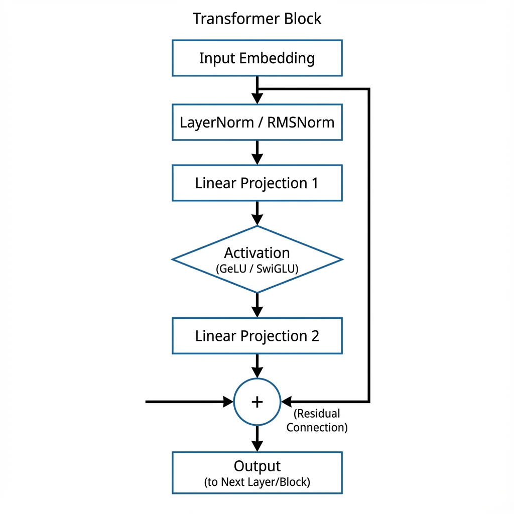

# Section 4: Feed-Forward Networks & Normalization Layers

After the Attention mechanism has allowed tokens to "communicate" and share context, we need a way to process these refined representations individually. This is where the **Position-wise Feed-Forward Network (FFN)** and **Normalization layers** come in.

*Figure 4: The data flow within a single Transformer block, highlighting the residual connection and the sequential nature of normalization and feed-forward processing.*

## 1. Feed-Forward Network (Position-wise)

Each block in a Transformer contains a fully connected feed-forward network, which is applied to each position separately and identically.

### 1.1 Mathematical Formulation

The FFN consists of two linear transformations with a non-linear activation in between:

$$\mathrm{FFN}(x) = \sigma(xW_1 + b_1)W_2 + b_2$$

Where:
*   $x$ is the input vector (token representation).
*   $W_1 \in \mathbb{R}^{d_{model} \times d_{ff}}$ is the first weight matrix.
*   $W_2 \in \mathbb{R}^{d_{ff} \times d_{model}}$ is the second weight matrix.
*   $\sigma$ is a non-linear activation function (typically ReLU or GeLU).
*   Typically, $d_{ff} = 4 \times d_{model}$.

### 1.2 Intuition: The Feature Mixer

Think of the Attention mechanism as a way for tokens to "look around" and gather information. The FFN, by contrast, is where each token "thinks" about the information it has gathered. By expanding the dimensionality (usually by a factor of 4) and applying a non-linearity, we allow the model to learn complex feature correlations that weren't possible in the original embedding space.

---

## 2. Normalization Layers

Deep networks are notoriously difficult to train because the distribution of inputs to each layer changes as the parameters of previous layers change. Normalization layers stabilize this process.

### 2.1 Layer Normalization (LayerNorm)

LayerNorm normalizes the inputs across the hidden dimension (features) for each individual token.

#### 2.1.1 Mathematical Formulation

For a vector $x$ of dimension $d$:
1.  **Calculate Mean**: $\mu = \frac{1}{d} \sum_{i=1}^{d} x_i$
2.  **Calculate Variance**: $\sigma^2 = \frac{1}{d} \sum_{i=1}^{d} (x_i - \mu)^2$
3.  **Normalize**: $\hat{x}_i = \frac{x_i - \mu}{\sqrt{\sigma^2 + \epsilon}}$
4.  **Scale and Shift**: $y_i = \gamma_i \hat{x}_i + \beta_i$

Where $\gamma$ (gain) and $\beta$ (bias) are learnable parameters.

---

## 3. Advanced: Modern Variants

As models have grown, researchers have found more efficient ways to handle activations and normalization.

### 3.1 RMSNorm: Efficiency through Simplicity

**RMSNorm** (Root Mean Square Layer Normalization) simplifies LayerNorm by removing the mean-centering operation. It assumes that re-scaling is sufficient for stabilization.

$$\mathrm{RMSNorm}(x) = \frac{x}{\sqrt{\frac{1}{d} \sum_{i=1}^d x_i^2 + \epsilon}} \odot \gamma$$

### 3.2 SwiGLU: Gated Activations

Most modern LLMs (like Llama 3) use **SwiGLU** instead of standard GeLU. It combines the Swish activation with Gated Linear Units.

$$\mathrm{SwiGLU}(x) = (\mathrm{Swish}_1(xW) \otimes xV)$$

---

## 4. Residual Connections

To ensure gradients flow smoothly through deep stacks of these layers, we use **Residual (Skip) Connections**. Instead of $y = f(x)$, we compute:

$$y = x + \mathrm{Sublayer}(x)$$

This "Identity shortcut" allows the model to learn small perturbations to the signal rather than having to reconstruct the entire signal at every layer.

---

## References

*   **[Layer Normalization (Ba et al., 2016)](https://arxiv.org/abs/1607.06450)**
    *   The original paper introducing LayerNorm to stabilize neural network training.
*   **[RMSNorm: Root Mean Square Layer Normalization (Zhang et al., 2019)](https://arxiv.org/abs/1910.07467)**
    *   Proposed a computationally efficient version of LayerNorm used in many modern LLMs.
*   **[GLU Variants Improve Transformer (Shazeer, 2020)](https://arxiv.org/abs/2002.05202)**
    *   Introduces SwiGLU and other gated activation functions that outperform ReLU/GeLU.
*   **[Understanding LLMs: A Comprehensive Overview (Xu et al., 2024)](https://arxiv.org/abs/2401.02038)**
    *   A deep dive into' the architectural choices of modern transformers.
*   **[A Gentle Introduction to Layer Normalization (Machine Learning Mastery)](https://machinelearningmastery.com/layer-normalization-for-transformers-and-bert/)**
    *   Practical tutorial on implementation and intuition for normalization layers.
