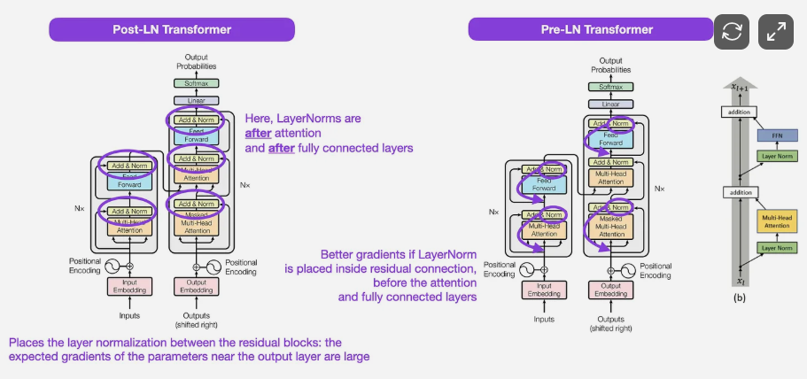

# Section 5: The Encoder Block

The **Encoder Block** is the fundamental repeating unit of a Transformer Encoder. While the original 2017 paper proposed a Post-Norm structure, modern LLMs (GPT, Llama, BERT-variants) have converged on the **Pre-Norm** architecture for its superior training stability. We will focus on this modern approach.

After processing inputs (Section 2), computing attention (Section 3), and applying feed-forward transformations (Section 4), we glue these components together using **Residual Connections** and **Normalization Layers**.

*Figure 1: Evolution of the Transformer Block. Left: The original Post-Norm design (Attention -> Add -> Norm). Middle: The modern Pre-Norm standard (Norm -> Attention -> Add). Right: Detailed Pre-Norm residual branch logic (Image source: Sebastian Raschka / arXiv:2002.04745).*

## 1. The Pre-Norm Architecture

In a Pre-Norm block, each sub-layer (Attention and FFN) is preceded by normalization. This ensures that the identity branch of the residual connection remains "clean," allowing gradients to flow more easily through deep stacks of blocks.

### 1.1 Mathematical Formulation

We define a single Encoder Block as a sequence of two main transformations. Given an input tensor $x \in \mathbb{R}^{L \times d_{model}}$:

1.  **Self-Attention Sub-layer**:
    $$x_{attn} = x + \text{MultiHeadAttention}(\text{LayerNorm}(x))$$

2.  **Feed-Forward Sub-layer**:
    $$x_{out} = x_{attn} + \text{FFN}(\text{LayerNorm}(x_{attn}))$$

In this formulation, the **Residual Connection** (the "Add" in Add & Norm) is represented by adding the original input back to the sub-layer's output.

## 2. Key Properties

- **Bidirectional Context**: Unlike the Decoder blocks we'll see later, the Encoder block is fully bidirectional. Every token can "see" every other token in the sequence, allowing for rich, contextualized representations.
- **Gradient Flow**: By placing normalization inside the residual branch, we prevent the "exploding/vanishing gradient" problems that plagued early deep architectures.
- **Depth**: We typically stack these blocks (e.g., $N=12$ for BERT-base) to build increasingly abstract representations of the input data.

## 3. Implementation Logic

When implementing the block, we must ensure that:
1. The `d_model` remains constant across all internal transformations.
2. The dropout (if applied) is used on the sub-layer output *before* the addition.
3. The residual connection is truly an identity operation.

---

## References

*   **[Attention Is All You Need (Vaswani et al., 2017)](https://arxiv.org/abs/1706.03762)** — The original Transformer architecture.
*   **[On Layer Normalization in the Transformer Architecture (Xiong et al., 2020)](https://arxiv.org/abs/2002.04745)** — Analysis of why Pre-Norm is more stable for training.
*   **[Understanding LLMs Survey (arXiv:2401.02038)](https://arxiv.org/pdf/2401.02038v2)** — Comprehensive overview of architectural variations in modern models.
